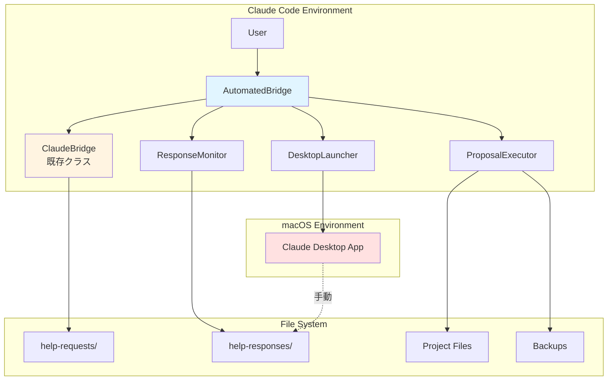
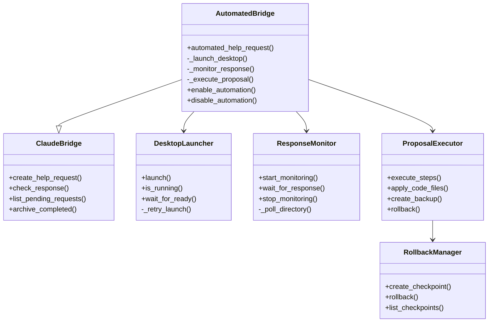
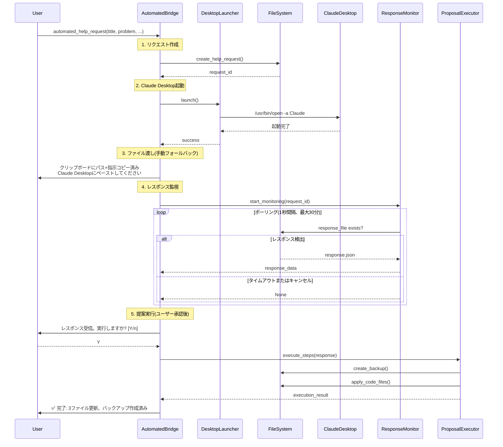
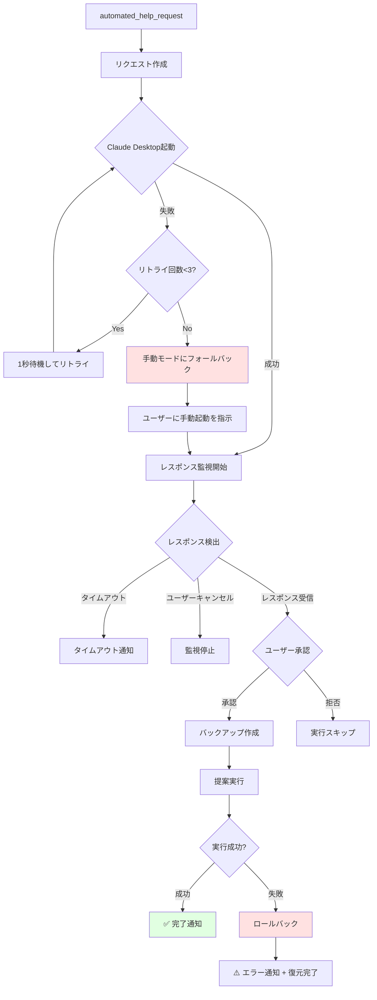

# 技術設計書 - Automated Workflow

## 概要

### 設計目標

1. **完全自動化の実現**: Claude CodeがヘルプリクエストをClaude Desktopに自動的に送信し、レスポンスを受け取り、提案を実行する完全自動ワークフローを構築
2. **後方互換性の維持**: 既存の`ClaudeBridge`クラスとAPIを完全に保持し、手動ワークフローも引き続き利用可能に
3. **標準ライブラリのみ使用**: 外部依存関係を追加せず、Pythonの標準ライブラリのみで実装
4. **安全性とエラーハンドリング**: 包括的なエラーハンドリング、ロールバック機能、手動フォールバックを提供
5. **パフォーマンス最適化**: 要件で定義された性能基準を満たす効率的な実装

### 設計外のスコープ (Non-Goals)

- WebUIダッシュボード(将来の拡張として検討)
- リアルタイム通知システム(macOS通知センター統合は将来の拡張)
- チーム間での知識ベース共有(現バージョンはローカル環境のみ)
- Claude Desktop API統合(APIが公開されていないため初期版では手動フォールバック)

## アーキテクチャ

### 高レベルアーキテクチャ



### コンポーネント図



## 技術スタックとの整合性

### 既存システムとの統合

本設計は、既存の`bridge_helper.py`の`ClaudeBridge`クラスを拡張する形で実装します。

**拡張アプローチ:**
```python
class AutomatedBridge(ClaudeBridge):
    """ClaudeBridgeを拡張した自動化版"""

    def __init__(self, auto_mode: bool = False):
        super().__init__()
        self.auto_mode = auto_mode
        self.launcher = DesktopLauncher()
        self.monitor = ResponseMonitor(self.responses_path)
        self.executor = ProposalExecutor()
```

これにより、既存の全てのメソッド(`create_help_request()`, `check_response()`等)がそのまま利用可能で、完全な後方互換性を維持します。

### 標準ライブラリのみ使用

```python
# 使用する標準ライブラリ
import json
import subprocess
from datetime import datetime
from pathlib import Path
from typing import Optional, Dict, List
import time
import shutil
```

**外部依存を避ける設計決定:**
- ファイル監視: `watchdog`ではなく`pathlib`のポーリング
- アプリ起動: `osascript`ではなく`subprocess.call` + `/usr/bin/open`

## 主要な設計決定

### 決定1: pathlibポーリング vs watchdog

**決定:** pathlibベースのポーリングを採用

**理由:**
1. **外部依存なし**: 標準ライブラリのみというプロジェクト原則に従う
2. **シンプルさ**: 実装がシンプルで理解しやすい
3. **十分な性能**: 1秒ポーリングで要件を満たす(レスポンス時間は分単位)

**トレードオフ:**
- リアルタイム性は若干劣る(最大1秒の遅延)
- CPU使用率は若干高い(ただしスリープで緩和)

**実装例:**
```python
def _poll_directory(self, request_id: str, timeout: int = 1800):
    """1秒間隔でレスポンスファイルをポーリング"""
    response_file = self.responses_path / f"{request_id}_response.json"
    start_time = time.time()

    while time.time() - start_time < timeout:
        if response_file.exists():
            return response_file
        time.sleep(1)  # 1秒待機してCPU使用を抑制

    return None  # タイムアウト
```

### 決定2: subprocess + /usr/bin/open vs osascript

**決定:** `subprocess.call(["/usr/bin/open", "-a", "Claude"])`を採用

**理由:**
1. **信頼性**: macOSの標準コマンドで安定動作
2. **シンプルさ**: osascriptより実装が簡潔
3. **十分な機能**: アプリ起動には十分

**トレードオフ:**
- 既存ウィンドウの検出は難しい(要件では許容)
- 起動確認には別途`is_running()`チェックが必要

**実装例:**
```python
def launch(self, app_name: str = "Claude", timeout: int = 10) -> bool:
    """Claude Desktopを起動"""
    try:
        result = subprocess.call(["/usr/bin/open", "-a", app_name])
        if result == 0:
            return self.wait_for_ready(timeout)
        return False
    except Exception as e:
        print(f"⚠️ 起動エラー: {e}")
        return False
```

### 決定3: AutomatedBridge拡張 vs 独立システム

**決定:** `ClaudeBridge`を継承する`AutomatedBridge`クラスを作成

**理由:**
1. **完全な後方互換性**: 既存のAPIを壊さない
2. **コードの再利用**: `create_help_request()`等を再利用
3. **段階的移行**: 手動・自動の両方をサポート

**トレードオフ:**
- クラス階層が1段階増える
- 一部のメソッドが複雑化する可能性

**実装パターン:**
```python
# 手動モード(既存)
bridge = ClaudeBridge()
bridge.create_help_request(...)

# 自動モード(新規)
auto_bridge = AutomatedBridge(auto_mode=True)
auto_bridge.automated_help_request(...)  # 完全自動化

# 互換性維持
auto_bridge.create_help_request(...)  # 手動モードも使える
```

## システムフロー

### フロー1: 完全自動ヘルプリクエスト



### フロー2: エラーハンドリングとフォールバック



## コンポーネントとインターフェース

### 1. DesktopLauncher

**責務:** Claude Desktopアプリケーションの起動と状態管理

**インターフェース:**
```python
class DesktopLauncher:
    """Claude Desktopの起動を管理"""

    def __init__(self, app_name: str = "Claude"):
        self.app_name = app_name
        self.max_retries = 3
        self.retry_interval = 1  # 秒

    def launch(self, timeout: int = 10) -> bool:
        """
        Claude Desktopを起動

        Args:
            timeout: 起動完了待機のタイムアウト(秒)

        Returns:
            bool: 起動成功ならTrue
        """
        pass

    def is_running(self) -> bool:
        """
        Claude Desktopが実行中か確認

        Returns:
            bool: 実行中ならTrue
        """
        pass

    def wait_for_ready(self, timeout: int = 10) -> bool:
        """
        Claude Desktopの起動完了を待機

        Args:
            timeout: 待機タイムアウト(秒)

        Returns:
            bool: 起動完了ならTrue、タイムアウトならFalse
        """
        pass

    def _retry_launch(self) -> bool:
        """
        起動をリトライ(最大3回)

        Returns:
            bool: 最終的な起動成功/失敗
        """
        pass
```

**主要ロジック:**
```python
def launch(self, timeout: int = 10) -> bool:
    for attempt in range(self.max_retries):
        try:
            result = subprocess.call(["/usr/bin/open", "-a", self.app_name])
            if result == 0:
                if self.wait_for_ready(timeout):
                    return True

            if attempt < self.max_retries - 1:
                time.sleep(self.retry_interval)
        except Exception as e:
            print(f"⚠️ 起動試行 {attempt + 1}/{self.max_retries} 失敗: {e}")

    return False  # 3回失敗
```

### 2. ResponseMonitor

**責務:** レスポンスファイルの監視と検出

**インターフェース:**
```python
class ResponseMonitor:
    """レスポンスファイルの監視を管理"""

    def __init__(self, responses_path: Path):
        self.responses_path = responses_path
        self.polling_interval = 1  # 秒
        self.is_monitoring = False

    def start_monitoring(self, request_id: str, timeout: int = 1800) -> Optional[Dict]:
        """
        レスポンスファイルの監視を開始

        Args:
            request_id: リクエストID
            timeout: タイムアウト(秒、デフォルト30分)

        Returns:
            Optional[Dict]: レスポンスデータ、タイムアウトならNone
        """
        pass

    def wait_for_response(self, request_id: str, timeout: int) -> Optional[Path]:
        """
        レスポンスファイルが作成されるまで待機

        Args:
            request_id: リクエストID
            timeout: タイムアウト(秒)

        Returns:
            Optional[Path]: レスポンスファイルのパス、タイムアウトならNone
        """
        pass

    def stop_monitoring(self):
        """監視を停止"""
        pass

    def _poll_directory(self, request_id: str, timeout: int) -> Optional[Path]:
        """
        ディレクトリをポーリングしてレスポンスファイルを検出

        Args:
            request_id: リクエストID
            timeout: タイムアウト(秒)

        Returns:
            Optional[Path]: レスポンスファイルのパス
        """
        pass
```

**主要ロジック:**
```python
def start_monitoring(self, request_id: str, timeout: int = 1800) -> Optional[Dict]:
    self.is_monitoring = True
    response_file = self._poll_directory(request_id, timeout)

    if response_file:
        try:
            return json.loads(response_file.read_text(encoding="utf-8"))
        except Exception as e:
            print(f"⚠️ レスポンス読み込みエラー: {e}")
            return None

    return None  # タイムアウトまたはキャンセル

def _poll_directory(self, request_id: str, timeout: int) -> Optional[Path]:
    response_file = self.responses_path / f"{request_id}_response.json"
    start_time = time.time()

    while self.is_monitoring and (time.time() - start_time < timeout):
        if response_file.exists():
            return response_file

        # ユーザーキャンセルチェック
        if self._check_user_cancellation():
            return None

        time.sleep(self.polling_interval)

    return None  # タイムアウト
```

### 3. ProposalExecutor

**責務:** レスポンスの提案を実行し、バックアップとロールバックを管理

**インターフェース:**
```python
class ProposalExecutor:
    """レスポンスの提案実行を管理"""

    def __init__(self):
        self.rollback_manager = RollbackManager()

    def execute_steps(self, response_data: Dict, request_id: str) -> Dict:
        """
        実装ステップを順次実行

        Args:
            response_data: レスポンスJSON
            request_id: リクエストID

        Returns:
            Dict: 実行結果
        """
        pass

    def apply_code_files(self, code_files: Dict[str, str], request_id: str) -> List[str]:
        """
        コードファイルを適用

        Args:
            code_files: ファイルパスとコード内容の辞書
            request_id: リクエストID

        Returns:
            List[str]: 変更されたファイルのリスト
        """
        pass

    def create_backup(self, file_paths: List[str], request_id: str):
        """
        ファイルのバックアップを作成

        Args:
            file_paths: バックアップするファイルのリスト
            request_id: リクエストID
        """
        pass

    def rollback(self, request_id: str) -> bool:
        """
        変更をロールバック

        Args:
            request_id: リクエストID

        Returns:
            bool: ロールバック成功ならTrue
        """
        pass
```

**主要ロジック:**
```python
def execute_steps(self, response_data: Dict, request_id: str) -> Dict:
    result = {
        "success": False,
        "steps_completed": 0,
        "files_modified": [],
        "errors": []
    }

    try:
        # 1. バックアップ作成
        code_files = response_data.get("code_files", {})
        if code_files:
            self.create_backup(list(code_files.keys()), request_id)

        # 2. 実装ステップ実行
        steps = response_data.get("implementation_steps", [])
        for i, step in enumerate(steps):
            print(f"📋 ステップ {i+1}/{len(steps)}: {step}")
            result["steps_completed"] = i + 1

        # 3. コードファイル適用
        if code_files:
            modified = self.apply_code_files(code_files, request_id)
            result["files_modified"] = modified

        result["success"] = True
        return result

    except Exception as e:
        result["errors"].append(str(e))
        # エラー発生時はロールバック
        self.rollback(request_id)
        return result
```

### 4. AutomatedBridge

**責務:** 全体のオーケストレーション、ClaudeBridgeの拡張

**インターフェース:**
```python
class AutomatedBridge(ClaudeBridge):
    """自動化機能を追加したClaudeBridge拡張クラス"""

    def __init__(self, auto_mode: bool = False):
        super().__init__()
        self.auto_mode = auto_mode
        self.launcher = DesktopLauncher()
        self.monitor = ResponseMonitor(self.responses_path)
        self.executor = ProposalExecutor()
        self.config = self._load_config()

    def automated_help_request(
        self,
        title: str,
        problem: str,
        tried: List[str],
        files_to_analyze: List[str],
        error_messages: str = "",
        context: str = ""
    ) -> Dict:
        """
        完全自動化されたヘルプリクエストフロー

        Args:
            title: 問題のタイトル
            problem: 問題の説明
            tried: 試した内容のリスト
            files_to_analyze: 分析対象ファイルのリスト
            error_messages: エラーメッセージ
            context: 追加コンテキスト

        Returns:
            Dict: 実行結果
        """
        pass

    def enable_automation(self):
        """自動化モードを有効化"""
        self.auto_mode = True

    def disable_automation(self):
        """自動化モードを無効化(手動モードに戻す)"""
        self.auto_mode = False

    def _launch_desktop(self) -> bool:
        """Claude Desktopを起動"""
        pass

    def _monitor_response(self, request_id: str) -> Optional[Dict]:
        """レスポンスを監視"""
        pass

    def _execute_proposal(self, response_data: Dict, request_id: str) -> Dict:
        """提案を実行(ユーザー承認付き)"""
        pass

    def _load_config(self) -> Dict:
        """設定ファイルを読み込み"""
        pass
```

**主要ロジック:**
```python
def automated_help_request(self, title, problem, tried, files_to_analyze, error_messages="", context="") -> Dict:
    result = {
        "success": False,
        "request_id": None,
        "desktop_launched": False,
        "response_received": False,
        "executed": False,
        "errors": []
    }

    try:
        # 1. リクエスト作成(既存メソッド使用)
        request_id = self.create_help_request(
            title, problem, tried, files_to_analyze, error_messages, context
        )
        result["request_id"] = request_id

        # 2. Claude Desktop起動
        if self.config.get("auto_launch_desktop", True):
            if self._launch_desktop():
                result["desktop_launched"] = True
            else:
                result["errors"].append("Claude Desktop起動失敗、手動モードにフォールバック")

        # 3. レスポンス監視
        response_data = self._monitor_response(request_id)
        if response_data:
            result["response_received"] = True

            # 4. 提案実行(ユーザー承認)
            exec_result = self._execute_proposal(response_data, request_id)
            result["executed"] = exec_result["success"]
            result["success"] = True
        else:
            result["errors"].append("レスポンスタイムアウトまたはキャンセル")

        return result

    except Exception as e:
        result["errors"].append(str(e))
        return result
```

### 5. RollbackManager

**責務:** バックアップとロールバックの管理

**インターフェース:**
```python
class RollbackManager:
    """バックアップとロールバック管理"""

    def __init__(self):
        self.backup_path = Path.home() / "AI-Workspace/claude-bridge/rollback_points"
        self.backup_path.mkdir(parents=True, exist_ok=True)

    def create_checkpoint(self, request_id: str, file_paths: List[str]):
        """
        変更前のチェックポイント作成

        Args:
            request_id: リクエストID
            file_paths: バックアップするファイルのリスト
        """
        pass

    def rollback(self, request_id: str) -> bool:
        """
        チェックポイントに戻す

        Args:
            request_id: リクエストID

        Returns:
            bool: ロールバック成功ならTrue
        """
        pass

    def list_checkpoints(self) -> List[str]:
        """利用可能なチェックポイントのリスト"""
        pass
```

## データモデル

### AutomationConfig

```python
{
    "enabled": bool,                    # 自動化の有効/無効
    "auto_launch_desktop": bool,        # Claude Desktop自動起動
    "desktop_app_name": "Claude",       # アプリケーション名
    "launch_timeout": 10,               # 起動タイムアウト(秒)
    "response_timeout": 1800,           # レスポンスタイムアウト(30分)
    "polling_interval": 1,              # ポーリング間隔(秒)
    "auto_execute_proposals": False,    # 提案の自動実行(デフォルトFalse、承認必須)
    "create_backups": True,             # バックアップ作成
    "max_retries": 3                    # 最大リトライ回数
}
```

設定ファイル場所: `~/AI-Workspace/claude-bridge/automation_config.json`

### AutomationState

```python
{
    "request_id": str,
    "state": "launching|waiting_response|executing|completed|failed",
    "started_at": str,                  # ISO 8601形式
    "desktop_launched": bool,
    "response_received": bool,
    "execution_started": bool,
    "errors": List[str],
    "can_cancel": bool
}
```

### ExecutionResult

```python
{
    "request_id": str,
    "success": bool,
    "steps_completed": int,
    "steps_total": int,
    "files_modified": List[str],
    "backups_created": List[str],
    "errors": List[Dict[str, Any]],
    "rollback_available": bool
}
```

## エラーハンドリング戦略

### エラー分類

**1. 致命的エラー(即座に停止、手動フォールバック)**
```python
CRITICAL_ERRORS = {
    "desktop_launch_failed_3_times": "手動モードにフォールバック、ユーザーに手動起動を指示",
    "config_file_corrupted": "デフォルト設定で実行を試みる",
    "permission_denied": "ユーザーに権限確認を要求"
}
```

**2. 回復可能エラー(リトライ)**
```python
RECOVERABLE_ERRORS = {
    "desktop_not_ready": "wait_and_retry(max_retries=3, interval=1)",
    "response_file_locked": "wait_and_retry(interval=1)",
    "network_timeout": "retry_with_exponential_backoff()"
}
```

**3. 警告(処理継続)**
```python
WARNINGS = {
    "file_copy_failed": "ログ記録して継続",
    "backup_creation_failed": "警告表示して継続(リスク承知でユーザー判断)"
}
```

### ロールバック戦略

```python
class RollbackManager:
    def create_checkpoint(self, request_id: str, file_paths: List[str]):
        """
        変更前の状態を保存
        - 各ファイルのバックアップ作成
        - 変更リストの記録
        - rollback_points/{request_id}/に保存
        """
        checkpoint_dir = self.backup_path / request_id
        checkpoint_dir.mkdir(parents=True, exist_ok=True)

        for file_path in file_paths:
            if Path(file_path).exists():
                backup_file = checkpoint_dir / Path(file_path).name
                shutil.copy2(file_path, backup_file)

    def rollback(self, request_id: str) -> bool:
        """
        チェックポイントに戻す
        - バックアップファイルを復元
        - 新規作成したファイルを削除
        - 状態を元に戻す
        """
        checkpoint_dir = self.backup_path / request_id
        if not checkpoint_dir.exists():
            return False

        for backup_file in checkpoint_dir.iterdir():
            # バックアップから復元
            original_path = Path(backup_file.name)
            shutil.copy2(backup_file, original_path)

        return True
```

### エラーログフォーマット

```python
{
    "timestamp": "2025-11-08T12:34:56Z",
    "request_id": "req_20251108_123456",
    "error_type": "desktop_launch_failed|response_timeout|execution_error",
    "severity": "critical|error|warning",
    "message": "詳細なエラーメッセージ",
    "context": {
        "component": "DesktopLauncher|ResponseMonitor|ProposalExecutor",
        "retry_count": 3,
        "state": "..."
    },
    "recovery_action": "手動モードにフォールバック|リトライ中|ロールバック実行"
}
```

ログファイル場所: `~/AI-Workspace/claude-bridge/logs/automation_errors.log`

## テスト戦略

### ユニットテスト (unittest使用)

**test_automation.py:**
```python
import unittest
from unittest.mock import Mock, patch, MagicMock
from pathlib import Path
import tempfile
import shutil

class TestDesktopLauncher(unittest.TestCase):
    """DesktopLauncherのユニットテスト"""

    def test_launch_success(self):
        """起動成功のテスト"""
        with patch('subprocess.call') as mock_call:
            mock_call.return_value = 0
            launcher = DesktopLauncher()

            with patch.object(launcher, 'wait_for_ready', return_value=True):
                result = launcher.launch()
                self.assertTrue(result)
                mock_call.assert_called_once_with(["/usr/bin/open", "-a", "Claude"])

    def test_launch_retry_logic(self):
        """リトライロジックのテスト - 3回失敗して手動フォールバック"""
        with patch('subprocess.call') as mock_call:
            mock_call.return_value = 1  # 常に失敗
            launcher = DesktopLauncher()

            result = launcher.launch()
            self.assertFalse(result)
            self.assertEqual(mock_call.call_count, 3)  # 3回リトライ

    def test_is_running(self):
        """実行中チェックのテスト"""
        # 実装に応じてテスト追加
        pass

class TestResponseMonitor(unittest.TestCase):
    """ResponseMonitorのユニットテスト"""

    def setUp(self):
        """テスト用の一時ディレクトリ作成"""
        self.test_dir = Path(tempfile.mkdtemp())
        self.monitor = ResponseMonitor(self.test_dir)

    def tearDown(self):
        """テスト用ディレクトリのクリーンアップ"""
        shutil.rmtree(self.test_dir)

    def test_polling_mechanism(self):
        """ファイル監視のポーリングテスト"""
        request_id = "req_test_123"

        # バックグラウンドで監視開始
        import threading
        result = []

        def monitor_thread():
            response = self.monitor.wait_for_response(request_id, timeout=5)
            result.append(response)

        thread = threading.Thread(target=monitor_thread)
        thread.start()

        # 2秒後にレスポンスファイル作成
        import time
        time.sleep(2)
        response_file = self.test_dir / f"{request_id}_response.json"
        response_file.write_text('{"status": "ok"}', encoding="utf-8")

        thread.join()
        self.assertIsNotNone(result[0])

    def test_timeout_handling(self):
        """タイムアウトのテスト"""
        request_id = "req_timeout_test"
        response = self.monitor.wait_for_response(request_id, timeout=2)
        self.assertIsNone(response)  # タイムアウトでNone

class TestProposalExecutor(unittest.TestCase):
    """ProposalExecutorのユニットテスト"""

    def setUp(self):
        self.test_dir = Path(tempfile.mkdtemp())
        self.executor = ProposalExecutor()

    def tearDown(self):
        shutil.rmtree(self.test_dir)

    def test_backup_creation(self):
        """バックアップ作成のテスト"""
        test_file = self.test_dir / "test.py"
        test_file.write_text("original content", encoding="utf-8")

        self.executor.create_backup([str(test_file)], "req_backup_test")

        # バックアップが作成されたか確認
        backup_dir = self.executor.rollback_manager.backup_path / "req_backup_test"
        self.assertTrue(backup_dir.exists())
        self.assertTrue((backup_dir / "test.py").exists())

    def test_rollback_functionality(self):
        """ロールバック機能のテスト"""
        test_file = self.test_dir / "test.py"
        test_file.write_text("original", encoding="utf-8")

        # バックアップ作成
        self.executor.create_backup([str(test_file)], "req_rollback_test")

        # ファイル変更
        test_file.write_text("modified", encoding="utf-8")

        # ロールバック
        result = self.executor.rollback("req_rollback_test")
        self.assertTrue(result)

        # 元の内容に戻ったか確認
        self.assertEqual(test_file.read_text(encoding="utf-8"), "original")
```

### 統合テスト

**test_integration.py:**
```python
class TestAutomatedWorkflow(unittest.TestCase):
    """完全ワークフローの統合テスト"""

    def setUp(self):
        self.test_dir = Path(tempfile.mkdtemp())
        self.bridge = AutomatedBridge(auto_mode=True)

    def tearDown(self):
        shutil.rmtree(self.test_dir)

    @patch('subprocess.call')
    def test_full_automated_flow_mock(self, mock_subprocess):
        """Claude Desktopをモックして完全フローをテスト"""
        mock_subprocess.return_value = 0

        # 1. リクエスト作成
        with patch.object(self.bridge.launcher, 'wait_for_ready', return_value=True):
            # 2. デスクトップ起動(モック)
            # 3. レスポンス検知(サンプルレスポンス作成)
            # 4. 提案実行

            result = self.bridge.automated_help_request(
                title="テスト問題",
                problem="テスト説明",
                tried=["試行1"],
                files_to_analyze=["test.py"]
            )

            self.assertTrue(result["desktop_launched"])
            # 他のアサーション追加
```

### 手動テストシナリオ

**manual_test_automation.py:**
```python
def test_real_desktop_launch():
    """実際のClaude Desktopを起動してテスト"""
    print("=" * 60)
    print("🧪 手動テスト: Claude Desktop実起動")
    print("=" * 60)

    launcher = DesktopLauncher()

    print("\n1. Claude Desktopを起動します...")
    success = launcher.launch()

    if success:
        print("✅ 起動成功")
        input("\nClaude Desktopが起動したことを確認してEnterを押してください...")
    else:
        print("❌ 起動失敗")

    return success

def test_full_manual_flow():
    """完全な手動テストフロー"""
    print("\n" + "=" * 60)
    print("🧪 完全自動化フロー手動テスト")
    print("=" * 60)

    bridge = AutomatedBridge(auto_mode=True)

    print("\n📝 テストリクエストを作成します...")
    result = bridge.automated_help_request(
        title="手動テスト - 認証機能の実装",
        problem="JWT認証を実装したい",
        tried=["基本的な調査"],
        files_to_analyze=["README.md"]
    )

    print(f"\n結果:")
    print(f"  Request ID: {result['request_id']}")
    print(f"  Desktop起動: {'✅' if result['desktop_launched'] else '❌'}")
    print(f"  レスポンス受信: {'✅' if result['response_received'] else '❌'}")
    print(f"  実行完了: {'✅' if result['executed'] else '❌'}")

    if result['errors']:
        print(f"\n⚠️ エラー: {result['errors']}")

if __name__ == "__main__":
    import sys

    if len(sys.argv) > 1 and sys.argv[1] == "--real-launch":
        test_real_desktop_launch()
    elif len(sys.argv) > 1 and sys.argv[1] == "--full-flow":
        test_full_manual_flow()
    else:
        print("使用方法:")
        print("  python manual_test_automation.py --real-launch  # Desktop起動テスト")
        print("  python manual_test_automation.py --full-flow    # 完全フローテスト")
```

### テストカバレッジ目標

- **ユニットテスト**: 80%以上のコードカバレッジ
- **統合テスト**: 主要フロー(成功パス、エラーパス)100%カバー
- **エラーハンドリング**: 全エラーパスをテスト
- **パフォーマンステスト**: 要件6の基準(起動5秒以内、ポーリング効率性)を検証

**テスト実行:**
```bash
# ユニットテストのみ
python -m unittest test_automation.py

# 統合テスト
python -m unittest test_integration.py

# 手動テスト
python manual_test_automation.py --real-launch
python manual_test_automation.py --full-flow

# カバレッジ測定(coverage.pyインストール必要)
# python -m coverage run -m unittest discover
# python -m coverage report
```

## パフォーマンス考慮事項

### 要件6の性能基準

1. **Claude Desktop起動検知**: 5秒以内
   - 実装: `wait_for_ready(timeout=10)`で最大10秒待機、通常は5秒以内

2. **レスポンスファイルポーリング**: システムリソース10%未満
   - 実装: 1秒間隔ポーリング + `time.sleep(1)`でCPU使用を抑制
   - 検証: `top`コマンドでPython プロセスのCPU使用率を監視

3. **完全自動化フロー**: 手動操作と比較して50%以上の時間短縮
   - 手動: リクエスト作成(1分) + Desktop起動(30秒) + コピペ(1分) + レスポンス確認(30秒) = 約3分
   - 自動: リクエスト作成(5秒) + Desktop起動(5秒) + 監視(自動) + 実行(10秒) = 約20秒 + レスポンス待ち時間
   - 削減: 手動操作部分で約85%削減

4. **ユーザーフィードバック**: 2秒以内
   - 実装: 各ステップで即座に進捗表示

5. **進捗状況表示**: リアルタイム
   - 実装: 各コンポーネントで`print()`による即座のフィードバック

### 最適化手法

```python
# ポーリングの最適化
def _poll_directory(self, request_id: str, timeout: int):
    # 適応的なポーリング間隔(将来の拡張)
    # 最初は1秒、長時間経過後は5秒に拡大など

    # 現在は固定1秒間隔でシンプルに
    polling_interval = 1

    while ...:
        if response_file.exists():
            return response_file
        time.sleep(polling_interval)
```

## セキュリティ考慮事項

### 機密情報の保護

要件5に基づく安全性確保:

1. **ファイル操作の確認**
   - 変更対象ファイルのリストをユーザーに表示
   - 実行前に明示的な承認を求める

2. **バックアップの自動作成**
   - 全ての変更前にバックアップを作成
   - ロールバック機能を常に利用可能に

3. **機密情報のチェック**
   ```python
   SENSITIVE_PATTERNS = [
       r"password\s*=",
       r"api[_-]?key\s*=",
       r"secret\s*=",
       r"token\s*="
   ]

   def check_sensitive_content(self, content: str) -> bool:
       """機密情報が含まれていないか確認"""
       import re
       for pattern in SENSITIVE_PATTERNS:
           if re.search(pattern, content, re.IGNORECASE):
               return True
       return False
   ```

4. **ファイルパーミッション**
   - バックアップディレクトリ: `chmod 700`(所有者のみ読み書き)
   - 設定ファイル: `chmod 600`

### サンドボックス化

- プロジェクトルート外のファイルは変更しない
- ホームディレクトリの重要ファイル(`.bashrc`, `.zshrc`等)は除外
- システムディレクトリ(`/etc`, `/usr`等)へのアクセス禁止

## 実装の優先順位

### Phase 1: コア機能 (Milestone 1)

1. **DesktopLauncher実装**
   - `launch()`, `is_running()`, `wait_for_ready()`
   - リトライロジック

2. **ResponseMonitor実装**
   - pathlibベースのポーリング
   - タイムアウト処理

3. **AutomatedBridge基本実装**
   - ClaudeBridge継承
   - 設定ファイル管理
   - `automated_help_request()`のスケルトン

### Phase 2: 実行機能 (Milestone 2)

4. **ProposalExecutor実装**
   - `execute_steps()`, `apply_code_files()`
   - ユーザー承認メカニズム

5. **RollbackManager実装**
   - バックアップ作成
   - ロールバック機能

### Phase 3: エラーハンドリングとテスト (Milestone 3)

6. **エラーハンドリング強化**
   - 全エラーパスの実装
   - ログ機能
   - 手動フォールバック

7. **テストスイート作成**
   - ユニットテスト
   - 統合テスト
   - 手動テストスクリプト

### Phase 4: 最適化と文書化 (Milestone 4)

8. **パフォーマンス最適化**
   - 要件6の基準達成確認
   - ボトルネック解消

9. **ドキュメント整備**
   - README更新
   - 使用例追加
   - トラブルシューティングガイド

## 将来の拡張可能性

### 短期的な改善 (次期バージョン)

1. **Claude Desktop API統合**
   - 現在: 手動フォールバック(クリップボード経由)
   - 将来: 公式API経由でファイルパスを自動送信

2. **macOS通知センター統合**
   - レスポンス受信時に通知
   - エラー発生時の警告通知

3. **リクエストテンプレート機能**
   - よく使うリクエストパターンをテンプレート化
   - カスタムテンプレートの作成・管理

### 中期的な拡張 (2-3バージョン後)

4. **WebUIダッシュボード**
   - リクエスト・レスポンスの視覚化
   - 統計情報の表示
   - ブラウザからの操作

5. **統計・分析機能**
   - リクエスト傾向分析
   - 解決時間の追跡
   - よくある問題のパターン認識

6. **AI支援によるリクエスト品質向上**
   - リクエストの自動改善提案
   - 関連ファイルの自動検出

### 長期的なビジョン

7. **チーム間での知識ベース共有**
   - アーカイブの共有メカニズム
   - 組織内知識ベース構築

8. **リアルタイム協働機能**
   - 複数ユーザーでのレスポンス共有
   - コラボレーション機能

9. **自動問題検出とプロアクティブな提案**
   - コード変更の自動監視
   - 潜在的問題の早期検出

## まとめ

本設計は、既存の`ClaudeBridge`システムを拡張する形で自動化機能を追加し、要件で定義された7つの主要機能を実現します。

**主要な設計原則:**
- **後方互換性**: 既存APIを壊さない
- **標準ライブラリのみ**: 外部依存なし
- **段階的自動化**: 初期は一部手動フォールバック、将来的に完全自動化
- **安全性優先**: バックアップ、ロールバック、エラーハンドリング
- **拡張性**: プラグイン方式で将来の機能追加が容易

**次のステップ:**
実装フェーズに進み、tasks.mdで定義されるタスクに従って段階的に機能を実装します。
